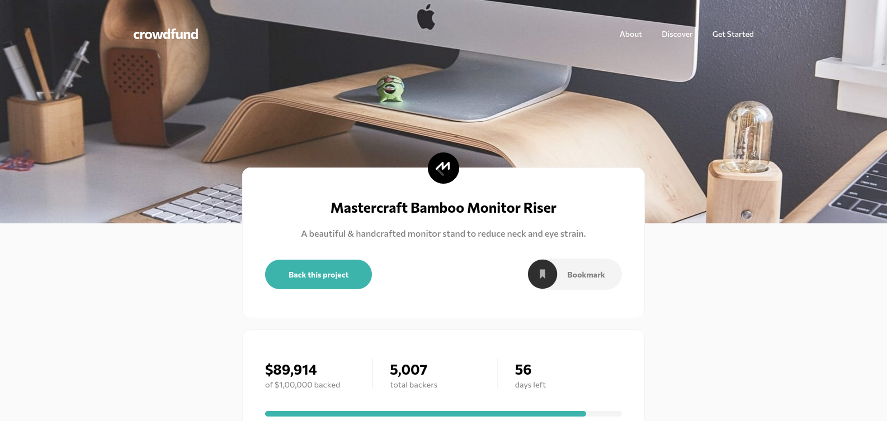

# Frontend Mentor - Crowdfunding product page solution

This is a solution to the [Crowdfunding product page challenge on Frontend Mentor](https://www.frontendmentor.io/challenges/crowdfunding-product-page-7uvcZe7ZR). Frontend Mentor challenges help you improve your coding skills by building realistic projects.

## Table of contents

- [Overview](#overview)
  - [The challenge](#the-challenge)
  - [Screenshot](#screenshot)
  - [Links](#links)
- [My process](#my-process)
  - [Built with](#built-with)
  - [What I learned](#what-i-learned)
  - [Continued development](#continued-development)
- [Author](#author)

## Overview

### The challenge

Users should be able to:

- View the optimal layout depending on their device's screen size
- See hover states for interactive elements
- Make a selection of which pledge to make
- See an updated progress bar and total money raised based on their pledge total after confirming a pledge
- See the number of total backers increment by one after confirming a pledge
- Toggle whether or not the product is bookmarked

### Screenshot

### Links

- Solution URL: [github](https://github.com/okcomputer93/crowdfunding-product-page)
- Live Site URL: [github pages](https://okcomputer93.github.io/crowdfunding-product-page/)

## My process

### Built with

- Semantic HTML5 markup
- CSS custom properties
- [React](https://reactjs.org/) - JS library
- [Styled Components](https://styled-components.com/) - For styles

### What I learned

I used this challenge to practice React + Styled Components, which are a great combination!. I had some minor issues styling React Portals, but fixed it using global styles in order to apply some css to components like modals, which are out of scope of nested styled components.

### Continued development

In order to keep this project simple I avoided the use of Redux, some props are passed from parent to children and so on. I'm planning merge this architecture to Redux to make things easier to understand.

## Author

- Website - [Omar Juarez](https://omarjuarez.com)
- Frontend Mentor - [@okcomputer93](https://www.frontendmentor.io/profile/okcomputer93)
